<!--
  Fun-but-professional GitHub Profile README for Oxidaner
  Put this README.md in your profile repo: github.com/Oxidaner/Oxidaner
  Also commit assets/github-hero.svg so the banner can render correctly.
-->

<div align="center">

  

  <br />

  

  <br />

  <a href="https://github.com/Oxidaner"></a>
  
  

</div>

---

## 👾 About me

I like building **reliable backend systems**, **developer tools**, and **AI-assisted workflows** that make engineering work less repetitive.

My favorite kind of project is the one that starts with a small annoying problem, becomes a useful tool, and eventually teaches me something about systems, trade-offs, and people.

```txt
> profile.scan()
role        = backend / tooling / AI workflow builder
style       = practical, maintainable, observable
weakness    = "just one more refactor"
superpower  = turning chaos into checklists
```

---

## 🕹️ Engineering RPG

<table>
  <tr>
    <td width="50%">
      <h3>🧭 Main Quest</h3>
      <ul>
        <li>Build services that are clear, stable, and easy to operate.</li>
        <li>Design small interfaces instead of giant magical abstractions.</li>
        <li>Use automation to remove repeatable engineering pain.</li>
      </ul>
    </td>
    <td width="50%">
      <h3>⚔️ Current Boss Fights</h3>
      <ul>
        <li>Backend architecture under real-world constraints.</li>
        <li>AI-native development workflows.</li>
        <li>Observability, reliability, and debugging messy systems.</li>
      </ul>
    </td>
  </tr>
  <tr>
    <td width="50%">
      <h3>🧪 Side Quests</h3>
      <ul>
        <li>Open-source exploration in Go ecosystems.</li>
        <li>Developer experience and internal tools.</li>
        <li>Prompting, RAG, agents, and LLM application patterns.</li>
      </ul>
    </td>
    <td width="50%">
      <h3>🏆 Loot I Care About</h3>
      <ul>
        <li>Readable code.</li>
        <li>Small abstractions.</li>
        <li>Useful logs and metrics.</li>
        <li>Systems that fail loudly and recover gracefully.</li>
      </ul>
    </td>
  </tr>
</table>

---

## 🧰 Toolbox

<div align="center">

### Languages


### Backend / Infra


### Frontend / Tools


</div>

---

## 🧩 What I enjoy building

<table>
  <tr>
    <td width="33%" align="center">
      <h3>🤖 AI Workflows</h3>
      <p>Agents, RAG, prompt pipelines, evaluation loops, and practical automation.</p>
    </td>
    <td width="33%" align="center">
      <h3>⚙️ Backend Systems</h3>
      <p>APIs, service architecture, caching, rate limiting, reliability, and observability.</p>
    </td>
    <td width="33%" align="center">
      <h3>🛠️ Developer Tools</h3>
      <p>Small tools that make debugging, reviewing, and shipping software less painful.</p>
    </td>
  </tr>
</table>

---

## 📊 GitHub telemetry

<table>
  <tr>
    <td width="50%">
      
    </td>
    <td width="50%">
      
    </td>
  </tr>
</table>


---

## 🐍 Contribution snake

<!--
  This image needs a GitHub Action to generate it.
  I included .github/workflows/snake.yml in the zip.
  After you commit it, wait for the workflow to run, then this snake will appear.
-->

<picture>
  <source media="(prefers-color-scheme: dark)" srcset="https://raw.githubusercontent.com/Oxidaner/Oxidaner/output/github-contribution-grid-snake-dark.svg" />
  <source media="(prefers-color-scheme: light)" srcset="https://raw.githubusercontent.com/Oxidaner/Oxidaner/output/github-contribution-grid-snake.svg" />
  
</picture>

---

## 🧠 Operating principles

```txt
clarity       > cleverness
boring tools  > fragile magic
small APIs    > giant abstractions
logs + metrics > guessing in production
ship → measure → learn → refine
```

<div align="center">

### “Make it work. Make it clear. Then make it boring.”


</div>
